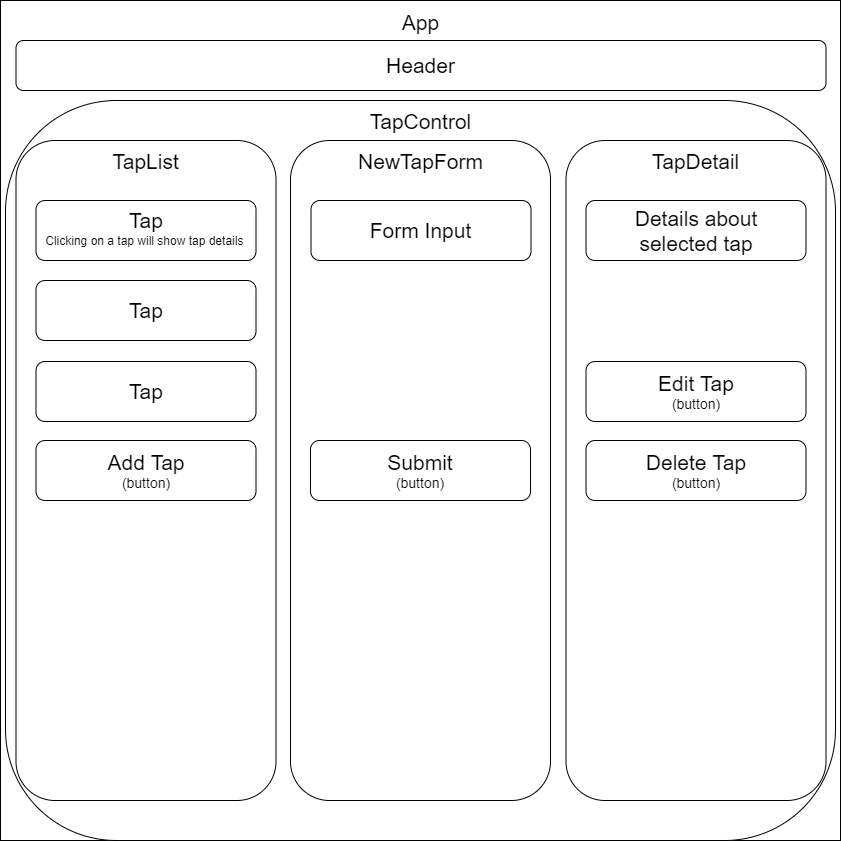

# Tap Room

#### Latest version date 9/11/2020

#### By Spencer Moody

## Description

An app which allows the user to create, edit, delete and keep track of of their inventory. 

## Diagram

## User Stories

* As a user, I want to see a list/menu of all available kegs. For each keg, I want to see its name, brand, price and alcoholContent (or perhaps something like flavor for a kombucha store).

* As a user, I want to submit a form to add a new keg to a list.

* As a user, I want to be able to click on a keg to see its detail page.

* As a user, I want to see how many pints are left in a keg. Hint: A full keg has roughly 124 pints.

* As a user, I want to be able to click a button next to a keg whenever I sell a pint of it. This should decrease the number of pints left by 1. Pints should not be able to go below 0.

## Setup

* To clone this repo, copy the url provided by the 'clone or download' button in GitHub
* In the command line use the command 'git clone (https://github.com/smoody0208/Tap-Room.git)'
* Open the repo in a code editor
* In the terminal enter the command `npm install` then `npm start` to run the program
* Navigate to: localhost: 3000 to view project

## Available Scripts

In the project directory, you can run:

### `npm start`

Runs the app in the development mode. 
Open [http://localhost:3000](http://localhost:3000) to view it in the browser.

The page will reload if you make edits. 
You will also see any lint errors in the console.

### `npm test`

Launches the test runner in the interactive watch mode. 
See the section about [running tests](https://facebook.github.io/create-react-app/docs/running-tests) for more information.

### `npm run build`

Builds the app for production to the `build` folder. 
It correctly bundles React in production mode and optimizes the build for the best performance.

The build is minified and the filenames include the hashes. 
Your app is ready to be deployed!

See the section about [deployment](https://facebook.github.io/create-react-app/docs/deployment) for more information.

### `npm run eject`

**Note: this is a one-way operation. Once you `eject`, you can’t go back!**

If you aren’t satisfied with the build tool and configuration choices, you can `eject` at any time. This command will remove the single build dependency from your project.

Instead, it will copy all the configuration files and the transitive dependencies (webpack, Babel, ESLint, etc) right into your project so you have full control over them. All of the commands except `eject` will still work, but they will point to the copied scripts so you can tweak them. At this point you’re on your own.

You don’t have to ever use `eject`. The curated feature set is suitable for small and middle deployments, and you shouldn’t feel obligated to use this feature. However we understand that this tool wouldn’t be useful if you couldn’t customize it when you are ready for it.

## Bugs

There are no currently known bugs.

## Tech used

* JavaScript
* React
* PropTypes Library
* JSX
* CSS

## Support and contact details

If you have any questions, run into any issues or bugs, or if you would like to contribute to this project, please contact Spencer Moody at spencer.moody@outlook.com.

### License

This project is licensed under the [MIT License](https://opensource.org/licenses/MIT).

Copyright (c) 2020 Spencer Moody

## Learn More

You can learn more in the [Create React App documentation](https://facebook.github.io/create-react-app/docs/getting-started).

To learn React, check out the [React documentation](https://reactjs.org/).
